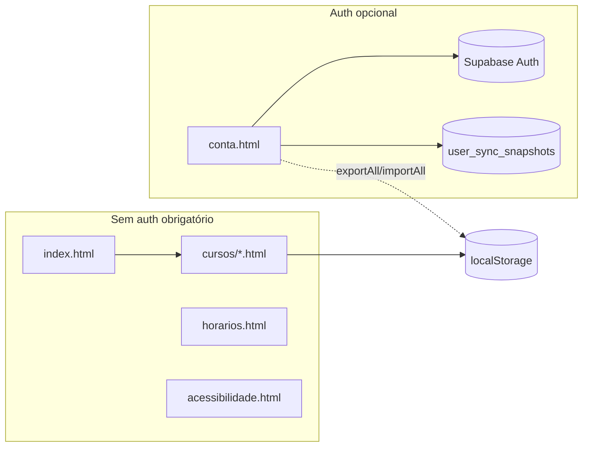

# Parecer e planejamento — Grade Curricular UNIPAMPA

**Data:** maio/2026  
**Base:** branch `dev` (commits `aa9104f` Supabase, `2d1ce5d` conta.html + tema claro)  
**Objetivo:** registrar o estado atual do código e o plano para a experiência personalizada (perfil, curso único, temas extras, entrada com opção “sem conta”).

---

## 1. Resumo executivo

O projeto é um **site estático** (HTML + JS modular + CSS) com **PWA** (`sw.js`). Os PPCs ficam em `js/cursos/*.js`; o progresso do aluno em **localStorage**; opcionalmente **Supabase Auth + sync** em `conta.html`.

| Camada | Estado |
|--------|--------|
| Grades interativas (7 cursos) | ✅ Estável, modular (`js/grade/*` + `main.js`) |
| Horários, FAQ, Acessibilidade | ✅ Funcionais |
| Login + sync nuvem | ✅ Em `conta.html` (não mais em Acessibilidade) |
| Tema claro padrão | ✅ `theme-init.js` + default `light` |
| **Visão “minha grade”** | ❌ Não implementada (perfil, sidebar filtrada, temas extras, landing) |

**Decisões de produto (validar com o professor):**

- Sempre oferecer **“continuar sem conta”** (pelo menos na fase acadêmica).
- Com conta: **um curso principal** na navegação; **“ver outros cursos”** discreto.
- Perfil: **nome, curso, período** (+ e-mail do auth).
- Temas: básicos para visitante; **temas extras** (cores) para quem tem conta.
- Dados e progresso **sincronizados na nuvem** quando logado.

---

## 2. Arquitetura atual

### 2.1 Estrutura de pastas (essencial)

```
index.html, conta.html, horarios.html, acessibilidade.html, faq.html, sobre.html
cursos/*.html          → 7 grades (uma por PPC)
js/
  main.js              → orquestrador da grade
  grade-storage.js     → export/import localStorage + contrato da nuvem
  siteprefs.js         → tema (3) + fonte
  theme-init.js        → tema antes do paint
  sidebar.js           → menu global injetado
  auth/                → Supabase (só conta.html)
  sync/cloud-sync.js   → push/pull user_sync_snapshots
  grade/               → motor (prereqs, render, modal, …)
  cursos/*.js          → dados PPC por sigla
css/style.css          → variáveis por data-theme
supabase/migrations/   → 001_user_sync.sql
docs/backend.md        → setup Supabase/Vercel
```

### 2.2 Fluxo de páginas



- **Nenhuma página de grade exige login** hoje.
- Auth carrega **apenas** em `conta.html` (5 scripts: config → client → session → cloud-sync → account-panel).

### 2.3 Contrato de dados (`GRADE_STORAGE.exportAll`)

Versão atual (`EXPORT_VERSION = 1`):

| Campo | Uso |
|-------|-----|
| `app`, `version`, `exportedAt` | Validação de backup |
| `theme`, `font`, `sidebar` | Preferências globais |
| `horariosCurso`, `horariosAvulsas` | Página Horários |
| `courses[sigla].progress` | Estados das disciplinas |
| `courses[sigla].cccgPicks`, `manualCh`, `notes` | CCCG, CH manual, agenda |

**Não existe:** `profile`, `onboardingComplete`, `guestMode`, `themeTier`.

Siglas: `es`, `cc`, `ec`, `ee`, `em`, `ea`, `et`.

### 2.4 Sync na nuvem

- Tabela `user_sync_snapshots`: uma linha por `user_id`, coluna `payload` = JSON inteiro do `exportAll()`.
- RLS: cada usuário só lê/escreve a própria linha.
- `syncAfterLogin()`: evita apagar progresso local com nuvem vazia; puxa prefs se remoto só tem preferências.

### 2.5 Temas

| `data-theme` | Quem vê hoje | CSS |
|--------------|--------------|-----|
| `light` | Todos (padrão JS) | Bloco `html[data-theme='light']` |
| `dark` | Todos | Variáveis em `:root` |
| `contrast` | Todos | Bloco alto contraste |

`:root` no CSS ainda comenta “tema escuro padrão”, mas o JS default é **claro** — alinhar comentário na Fase 0.

### 2.6 Service Worker

- Cache `grade-unipampa-v27`; `supabase-config.js` = **network-only**.
- Lista inclui `conta.html`, `theme-init.js`.
- Localhost: SW desabilitado (`sw-register.js`).

---

## 3. Lacunas em relação à visão

| Requisito | Situação | Onde mexer |
|-----------|----------|------------|
| Entrada com “sem conta” explícita | Parcial (site já abre livre; falta landing/CTA claro) | Nova `entrar.html` ou evoluir `index` + `conta.html` |
| Perfil (nome, curso, período) | Ausente | `grade-storage.js`, UI onboarding, opcional coluna SQL |
| Sidebar: só meu curso + “ver outros” | Ausente | `sidebar.js`, LS `profile.curso` |
| Temas extras (logado) | Ausente | `siteprefs.js`, `style.css`, gate por sessão |
| Onboarding pós-login | Ausente | `conta.html` + `js/auth/onboarding.js` |
| Index personalizado (“Olá, Sam”) | Ausente | `index.html` + `js/profile-ui.js` |
| Sync automático ao marcar disciplina | Planejado, não feito | `main.js` + debounce em `cloud-sync.js` |
| Docs/README alinhados à nuvem | Desatualizados | `README.md`, `faq.html`, `docs/backend.md` |

---

## 4. Supabase e Vercel — o que fazer agora

### 4.1 Já feito no código

- Redirect OAuth/email → `{SUPABASE_SITE_URL}/conta.html` (`js/auth/session.js`).
- Login removido de `acessibilidade.html`; link para `conta.html`.

### 4.2 Supabase (Dashboard)

**Link:** [URL Configuration](https://supabase.com/dashboard/project/zolbpvukluhaaekugwgi/auth/url-configuration)

| Item | Ação |
|------|------|
| **Redirect URLs** | Manter/adicionar `*/conta.html` (localhost:3000, preview `.vercel.app`, produção) |
| `acessibilidade.html` | Opcional remover após testes (legado) |
| **Site URL** | URL base do ambiente (sem path) |
| **SQL** | **Nenhuma migration obrigatória** só por mover a página de login |
| **Google OAuth** | Redirect no Google Cloud = callback Supabase (inalterado); testar fluxo até `conta.html` |

**Fase 2+ (perfil):** duas opções:

1. **Recomendada (menor mudança):** incluir `profile` dentro do `payload` JSON (sem nova tabela).
2. **Alternativa:** tabela `user_profiles (user_id, nome, curso_sigla, periodo, …)` + RLS — melhor para consultas/admin, mais trabalho.

### 4.3 Vercel

| Item | Ação |
|------|------|
| Env vars Preview/Production | `SUPABASE_URL`, `SUPABASE_ANON_KEY`, `SUPABASE_SITE_URL` (base do deploy) |
| Build | `npm run build` → gera `supabase-config.js` |
| Redeploy | Após cada mudança de env ou commit que afete auth |
| Production | Configurar env vars ao merge `dev` → `main` |

**Não precisa** de nova variável de ambiente para `conta.html`.

---

## 5. Roadmap proposto

### Fase 0 — Documentação e higiene (0,5 dia) ✅

- [x] Atualizar `docs/backend.md` (redirects `conta.html`, testes na página Conta).
- [x] Atualizar `README.md` e trechos do `faq.html` sobre nuvem + backup JSON vs sync.
- [x] Comentário CSS `:root` alinhado ao default claro.
- [ ] Checklist Supabase redirects + teste OAuth/email no preview (manual).

**Sem mudança de schema.**

---

### Fase 1 — Modelo de perfil e modo visitante (1–2 dias) ✅

**Objetivo:** dados de perfil no backup/nuvem; modo “convidado” explícito.

1. Estender `exportAll` / `importAll` (`EXPORT_VERSION = 2`):

```json
{
  "version": 2,
  "profile": {
    "nome": "string",
    "curso": "es",
    "periodo": 3,
    "onboardingDone": true
  },
  "guest": false
}
```

2. Chaves LS: `grade_unipampa_profile_v1` (espelho para leitura rápida) ou só dentro do export.
3. `js/profile.js` — leitura/escrita de perfil, `getCursoPrincipal()`, `isGuest()`.
4. Migração v1→v2: se `version < 2`, perfil vazio, `guest: true` implícito.

**Supabase:** nenhuma migration; `payload` já é JSONB flexível.

---

### Fase 2 — Onboarding e entrada (1–2 dias) ✅

**Objetivo:** fluxo claro ao entrar; sempre “continuar sem conta”.

Opção A (recomendada): **`entrar.html`** como landing opcional:

- Botões: **Entrar / Criar conta** → `conta.html`
- **Continuar sem conta** → `index.html` + flag `guest=true` em sessionStorage
- Após login bem-sucedido → formulário curso/nome/período (se `!onboardingDone`) → redirect para grade do curso

Opção B: tudo em `conta.html` (abas “Entrar” / “Sem conta”).

Arquivos:

- `entrar.html` (novo) ou refatorar `conta.html`
- `js/auth/onboarding.js`
- `account-panel.js` — pós-login, exibir wizard
- `session.js` — redirect pós-OAuth para onboarding se necessário

**Validação com professor:** entrada obrigatória em `entrar.html` vs link discreto na index.

---

### Fase 3 — Navegação personalizada (1 dia) ✅

**Objetivo:** sidebar mostra só o curso do perfil; “Ver outros cursos” pouco destacado.

- `sidebar.js`:
  - Se `profile.curso` e não `guest` e não `verTodosCursos`: lista só 1 link de curso + item secundário “Outros cursos…”
  - Toggle `verTodosCursos` em sessionStorage (não precisa ir à nuvem)
- `index.html`: se perfil definido, cards destacam o curso principal; demais em seção colapsada “Outros cursos”.
- Header: saudação opcional (`Olá, {nome}`) via `js/profile-ui.js` (leve, sem auth nas grades).

---

### Fase 4 — Temas extras para conta (1–2 dias)

**Objetivo:** visitante = 3 temas; logado = + paletas (pesquisa identidade UNIPAMPA).

Temas candidatos (pesquisar Manual de Identidade UNIPAMPA):

| ID | Público | Notas |
|----|---------|-------|
| `light` | Todos | Verde institucional (atual) |
| `dark` | Todos | Atual |
| `contrast` | Todos | A11y |
| `ocean` | Logado | Azul derivado da paleta |
| `sunset` | Logado | Âmbar/laranja suave |
| `night-blue` | Logado | Roxo/azul escuro alternativo |

Implementação:

- Novos blocos `html[data-theme='ocean']` etc. em `style.css` (só variáveis CSS).
- `siteprefs.js`: `getAvailableThemes({ loggedIn })`.
- `acessibilidade.html`: opções dinâmicas; mensagem “mais temas com conta”.
- `theme-init.js`: respeitar tema salvo (incluindo novos ids).
- Sync: novos valores já vão no campo `theme` do export.

**Não exige mudança Supabase.**

---

### Fase 5 — UX logada e sync (1–2 dias)

- Indicador na sidebar: ícone Conta com estado (logado / convidado).
- Sync debounced ao salvar progresso (ex. 3s após última alteração, só se logado).
- Mensagens PT consistentes em `account-panel.js`.
- FAQ: fluxo backup JSON **e** nuvem.

---

### Fase 6 — Produção e apresentação acadêmica

- Merge `dev` → `main`, env Production na Vercel.
- CHANGELOG entrada da versão (ex. v1.1.0-personalização).
- Roteiro de demo: visitante → sem conta → criar conta → onboarding → grade filtrada → tema extra → sync segundo dispositivo.

---

## 6. Mapa de arquivos por fase

| Fase | Arquivos principais |
|------|---------------------|
| 0 | `docs/backend.md`, `README.md`, `faq.html` |
| 1 | `js/grade-storage.js`, `js/profile.js` (novo) |
| 2 | `entrar.html` ou `conta.html`, `js/auth/onboarding.js`, `account-panel.js`, `session.js` |
| 3 | `js/sidebar.js`, `index.html`, `js/profile-ui.js` (novo) |
| 4 | `css/style.css`, `js/siteprefs.js`, `acessibilidade.html`, `theme-init.js` |
| 5 | `js/main.js`, `js/sync/cloud-sync.js`, `js/sidebar.js`, `faq.html` |
| 6 | `CHANGELOG.md`, Vercel, Supabase Production |

---

## 7. Riscos e decisões em aberto

| Tópico | Risco | Mitigação |
|--------|-------|-----------|
| `EXPORT_VERSION = 2` | Backups antigos | Import detecta version e preenche defaults |
| Professor exige login | Conflito com “sem conta” | Manter flag `guest`; documentar no README |
| Temas extras e contraste | A11y | Testar contraste WCAG por tema; manter `contrast` para todos |
| Sync automático | Conflito local/remoto | Manter regra atual: não sobrescrever progresso sem ação do usuário |
| Cache SW | Usuário vê JS velho | Bump `CACHE` em `sw.js` a cada release |

**Decisão pendente:** landing obrigatória (`entrar.html` na raiz) vs index atual com banner “Personalizar”.

---

## 8. Ordem sugerida para implementar amanhã

1. **Fase 0** — docs + checklist Supabase (15 min).
2. **Fase 1** — `profile` no JSON + `profile.js` (base de tudo).
3. **Fase 2** — onboarding em `conta.html` + botão “sem conta”.
4. **Fase 3** — sidebar filtrada.
5. **Fase 4** — temas extras.
6. **Fase 5** — sync auto + polish.

Cada fase pode virar um commit separado na `dev` para facilitar review com o professor.

---

## 9. Referências no repositório

| Tópico | Arquivo |
|--------|---------|
| Export/import | `js/grade-storage.js` |
| Sync login | `js/sync/cloud-sync.js` |
| UI conta | `js/auth/account-panel.js`, `conta.html` |
| Redirect auth | `js/auth/session.js` (~L25–30) |
| Sidebar | `js/sidebar.js` |
| Temas | `js/siteprefs.js`, `js/theme-init.js`, `css/style.css` |
| SQL | `supabase/migrations/001_user_sync.sql` |
| Deploy | `vercel.json`, `scripts/generate-supabase-config.mjs` |

---

*Documento vivo: atualizar conforme decisões com o professor e entregas por fase.*
