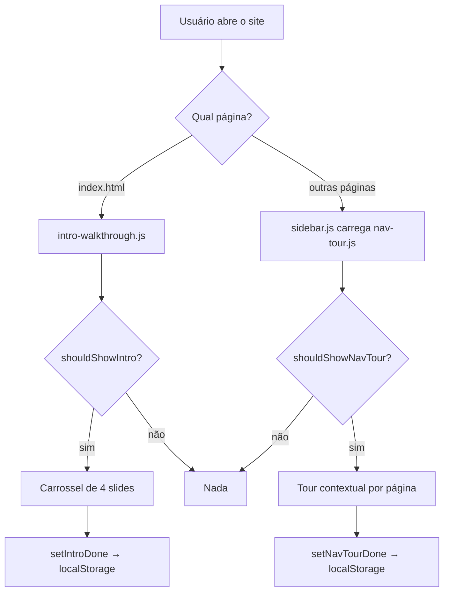

# Relatório: Walkthrough no sistema Grade Curricular UNIPAMPA

Este documento descreve como o walkthrough foi implementado neste projeto, para você replicar a abordagem em outro sistema. A implementação é **100% vanilla JavaScript + CSS**, sem bibliotecas externas (Driver.js, Shepherd, Intro.js, etc.).

---

## Visão geral da arquitetura

O walkthrough é dividido em **duas fases independentes**, com persistência separada:

| Fase | Arquivo | Onde roda | O que faz |
|------|---------|-----------|-----------|
| **Intro (carrossel)** | `js/walkthrough/intro-walkthrough.js` | Apenas `index.html` | Modal com slides explicando o projeto |
| **Tour de navegação** | `js/walkthrough/nav-tour.js` | Demais páginas (grade, horários, FAQ…) | Tooltips com spotlight nos elementos da UI |

Arquivos de suporte:

- `js/walkthrough/storage.js` — controle de “já viu ou não” via `localStorage`
- `css/walkthrough.css` — estilos de intro + tour + temas escuros/alto contraste



---

## 1. Persistência — “só na primeira vez”

Toda a lógica de “rodar uma vez” está em `js/walkthrough/storage.js`:

```javascript
const INTRO_KEY = 'grade_unipampa_walkthrough_intro_v1';
const NAV_TOUR_KEY = 'grade_unipampa_walkthrough_nav_v1';

/**
 * Só para testes locais. Com `true`, intro e tour aparecem a cada recarregamento.
 * Voltar para `false` antes de publicar.
 */
const ALWAYS_SHOW_WALKTHROUGH = false;

root.GRADE_WALKTHROUGH_STORAGE = {
  shouldShowIntro: () =>
    ALWAYS_SHOW_WALKTHROUGH || !readFlag(INTRO_KEY) || replayRequested('intro'),
  shouldShowNavTour: () =>
    ALWAYS_SHOW_WALKTHROUGH || !readFlag(NAV_TOUR_KEY) || replayRequested('nav'),
};
```

**Como funciona:**

1. Ao concluir ou pular, grava `'1'` no `localStorage` com as chaves acima.
2. Nas próximas visitas, `shouldShowIntro()` / `shouldShowNavTour()` retornam `false`.
3. Flag de dev `ALWAYS_SHOW_WALKTHROUGH = true` força exibição a cada reload.
4. Query string `?replay-tour=intro`, `?replay-tour=nav` ou `?replay-tour=all` também força replay.

**Para o seu próximo sistema (rodar sempre que abrir):**

| Objetivo | O que mudar |
|----------|-------------|
| Rodar **a cada abertura do app** (cada visita/sessão) | Remover `localStorage` e chamar `open()` sempre no `init()`, **sem** chamar `setIntroDone` / `setNavTourDone` no `finish()` |
| Rodar **a cada reload** durante dev | Equivalente a `ALWAYS_SHOW_WALKTHROUGH = true` |
| Rodar **uma vez por sessão do navegador** | Trocar `localStorage` por `sessionStorage` |

A parte visual (carrossel + tour) pode ser reutilizada quase intacta; a mudança principal é no módulo de storage e nas chamadas de `finish()`.

---

## 2. Intro — carrossel na tela inicial

**Arquivo:** `js/walkthrough/intro-walkthrough.js`  
**Carregamento:** incluído diretamente no `index.html`:

```html
<script src="js/walkthrough/storage.js"></script>
<script src="js/walkthrough/intro-walkthrough.js"></script>
```

### Conteúdo

Array `SLIDES` com `icon`, `title`, `body` e `note` opcional. Cada slide vira um `<article>` no carrossel.

### Ciclo de vida

1. **IIFE** expõe `globalThis.GRADE_INTRO_WALKTHROUGH = { open, finish, init }`.
2. `init()` roda automaticamente ao carregar o script.
3. Só executa se:
   - a URL for `/` ou terminar em `/index.html` (`shouldRunOnIndex()`);
   - `storage.shouldShowIntro()` for `true`.
4. `open()` injeta o HTML no `document.body`, bloqueia scroll com `body.wt-intro-open` e foca o botão “Próximo”.
5. `finish()` esconde o modal, remove a classe do body e chama `storage.setIntroDone(true)`.

### Interações

- Botões Anterior / Próximo / Pular / “Começar” (último slide)
- Dots clicáveis
- Swipe touch (delta ≥ 48px)
- Teclado: `ArrowLeft` / `ArrowRight` / `Escape`
- Carrossel via `transform: translateX(-${index * 100}%)` no track

### Acessibilidade

- `role="dialog"`, `aria-modal="true"`, `aria-hidden` por slide
- Dots com `aria-label` e `aria-selected`

---

## 3. Tour de navegação — spotlight contextual

**Arquivo:** `js/walkthrough/nav-tour.js`  
**Carregamento:** lazy via `sidebar.js` (presente em todas as páginas internas):

```javascript
function initNavTour() {
  const base = rootBase || './';
  loadWalkthroughAsset(`${base}css/walkthrough.css`, 'link')
    .then(() => loadWalkthroughAsset(`${base}js/walkthrough/storage.js`, 'script'))
    .then(() => loadWalkthroughAsset(`${base}js/walkthrough/nav-tour.js`, 'script'))
    .catch((err) => console.warn('walkthrough:', err));
}

initNavTour();
```

Ordem: CSS → storage → nav-tour (storage precisa existir antes do tour).

### Definição dos passos

Cada passo em `STEPS` tem:

```javascript
{
  id: 'sidebar',
  title: 'Menu lateral',
  body: 'Texto explicativo...',
  page: 'grade',           // opcional: filtra por tipo de página
  placement: 'right',      // right | left | bottom | top
  findTarget: () => document.getElementById('sidebar'),
}
```

**Filtro por página** (`pageKind()`):

- `/cursos/` → `'grade'`
- URL com `horarios` → `'horarios'`
- resto → `'other'`

Só entram passos sem `page` ou com `page` igual ao tipo atual.

### Mecânica do spotlight

1. `findTarget()` localiza o elemento (com retry assíncrono).
2. `prepareTarget()` prepara a UI (ex.: expandir sidebar colapsada, abrir painel de progresso).
3. `positionTourUi()` usa `getBoundingClientRect()` para posicionar:
   - **Spotlight:** div com `box-shadow: 0 0 0 9999px rgba(...)` (escurece tudo exceto o buraco).
   - **Card:** tooltip com seta via `::before` e variáveis CSS `--wt-arrow-left` / `--wt-arrow-top`.
4. Colisão: se `placement: 'right'` não couber, cai para `'bottom'`.
5. Mobile (`max-width: 768px`): sidebar/horários/FAQ usam `'bottom'`.

### Espera pelo DOM

```javascript
const WAIT_MS = 80;
const MAX_WAIT_ATTEMPTS = 60;  // ~4,8s máximo
```

`waitForTarget()` tenta de novo a cada 80ms até o elemento existir — importante em páginas que renderizam a grade depois.

### Delays de inicialização

```javascript
function init() {
  if (!shouldRun()) return;
  const delay = pageKind() === 'grade' ? 900 : 400;
  const start = () => setTimeout(open, delay);
  // ...
}
```

- **900ms** na grade (cards, toolbar, progresso)
- **400ms** nas demais páginas

### Integração com outros módulos

- `window.setGradeStripOpen(true)` (`js/mobile-nav.js`) — abre o painel “Resumo da grade” no passo de progresso.
- `#sidebar-toggle` — expande sidebar colapsada no passo do menu.
- Requer `#sidebar` no DOM; sem sidebar, o tour não abre.

### Eventos

- Resize e scroll (capture) reposicionam o passo atual (debounce 120ms).
- Teclado: `Escape`, setas.
- Ao concluir/pular: `storage.setNavTourDone(true)`.

---

## 4. Estilos (`css/walkthrough.css`)

- Tokens derivados do tema: `--text`, `--surface`, `--accent`, etc.
- Intro: modal centralizado, backdrop blur, z-index `12000`.
- Tour: z-index `11900`, spotlight + card fixos.
- Suporte a temas escuros (`dark`, `ocean`, `nord`, `cyberpunk`, `miku`) e alto contraste.
- Reutiliza classes de botão existentes: `.a11y-btn`, `.a11y-btn--primary`, `.a11y-btn--ghost`.

---

## 5. Service Worker

Em `sw.js`, os arquivos do walkthrough entram no cache offline — funciona sem rede após a primeira visita.

---

## 6. Padrão de módulos (para replicar)

Cada parte segue o mesmo padrão:

```javascript
(function (root) {
  'use strict';
  const storage = root.GRADE_WALKTHROUGH_STORAGE;
  if (!storage) return;

  // estado, SLIDES/STEPS, funções...

  root.GRADE_INTRO_WALKTHROUGH = { open, finish, init };
  init(); // auto-start
})(typeof globalThis !== 'undefined' ? globalThis : window);
```

Vantagens: sem bundler, compatível com script tags, API global para testes (`GRADE_INTRO_WALKTHROUGH.open()` no console).

---

## 7. Checklist para replicar no seu sistema

### Estrutura de arquivos

```
css/walkthrough.css
js/walkthrough/storage.js      ← adaptar persistência
js/walkthrough/intro-walkthrough.js
js/walkthrough/nav-tour.js
```

### Integração

1. **Página inicial:** link CSS + scripts `storage.js` + `intro-walkthrough.js`.
2. **Demais páginas:** carregar CSS + storage + nav-tour (direto ou lazy como no `sidebar.js`).
3. Garantir IDs/classes usados em `findTarget()` no seu HTML.
4. Expor helpers globais se o tour precisar abrir painéis (como `setGradeStripOpen`).

### Conteúdo

- Editar `SLIDES` (intro) e `STEPS` (tour) com textos e seletores do seu sistema.
- Usar `page` nos passos que só fazem sentido em certas telas.

### Sua diferença: rodar sempre

**Opção A — mais simples (recomendada):**

```javascript
// storage.js — versão “sempre mostrar”
shouldShowIntro: () => true,
shouldShowNavTour: () => true,

// e em intro-walkthrough.js / nav-tour.js, remover ou comentar:
// storage.setIntroDone(true);
// storage.setNavTourDone(true);
```

**Opção B — manter replay manual:**

Manter storage, mas iniciar com `ALWAYS_SHOW_WALKTHROUGH = true` ou equivalente.

**Opção C — uma vez por sessão:**

Trocar `localStorage` por `sessionStorage` em `readFlag` / `writeFlag`.

---

## 8. Pontos de atenção na replicação

1. **Ordem de scripts:** storage antes de intro/nav-tour; na grade, DOM pronto antes do tour (delay ou `waitForTarget`).
2. **Elementos dinâmicos:** passos como `disc-card` dependem da grade renderizada — o polling de `waitForTarget` cobre isso.
3. **Index vs. internas:** intro só na home; tour **não** roda no index (`shouldRun()` retorna `false` lá).
4. **Sidebar obrigatória:** tour exige `#sidebar`.
5. **Onboarding de login** (`js/auth/onboarding.js`) é fluxo separado — perfil pós-login, não confundir com walkthrough.
6. **Acessibilidade:** manter `role="dialog"`, foco no botão principal ao abrir, `Escape` para fechar.

---

## 9. Resumo executivo

| Aspecto | Decisão neste projeto |
|---------|------------------------|
| Biblioteca | Nenhuma — JS/CSS próprios |
| Fases | Intro (carrossel) + tour (spotlight) |
| Persistência | `localStorage`, chaves separadas intro/nav |
| “Só na 1ª vez” | Flags gravadas em `finish()` |
| Carregamento | Estático no index; lazy nas outras páginas |
| Posicionamento | `getBoundingClientRect` + fallback de placement |
| Mobile | Swipe no intro; placement adaptativo no tour |

Para o seu sistema com walkthrough **a cada abertura**, reutilize intro + nav-tour + CSS quase sem mudanças; altere principalmente `storage.js` (sempre retornar `true` em `shouldShow*`) e remova as gravações em `finish()`.
